# Foot Pedal Driven Sheet Music

Created to deal with changing pages when serving sheet music via a laptop/monitor.

Follows the [Adafruit Usb Foot Switch](https://learn.adafruit.com/usb-foot-switch/overview) build, with a custom written viewer that loads sheet music via image file or pdf, and scrolls through them with each foot press.

## Video
[Click here to see it working](https://streamable.com/wvg2b)

## Build log

Components with disassembled pedal
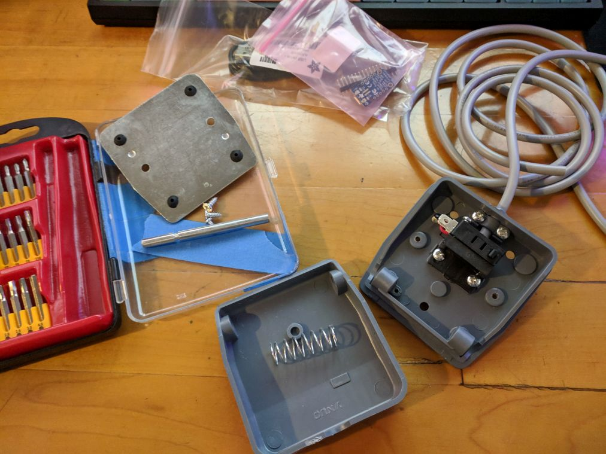

Trinket 5V 8MHz
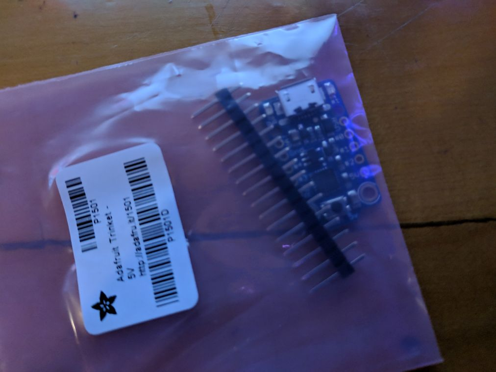

Closeup of foot pedal switch and original cabling
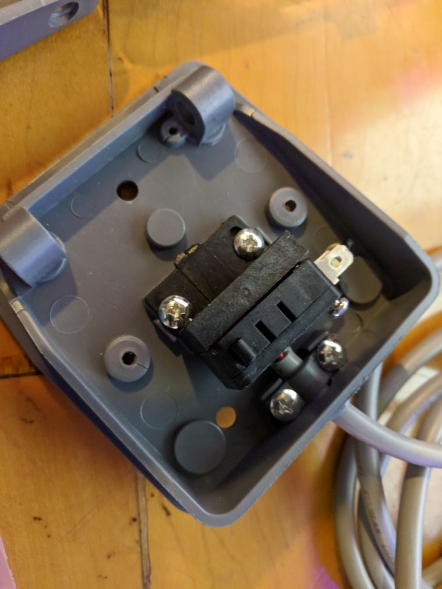

Stripped original cable
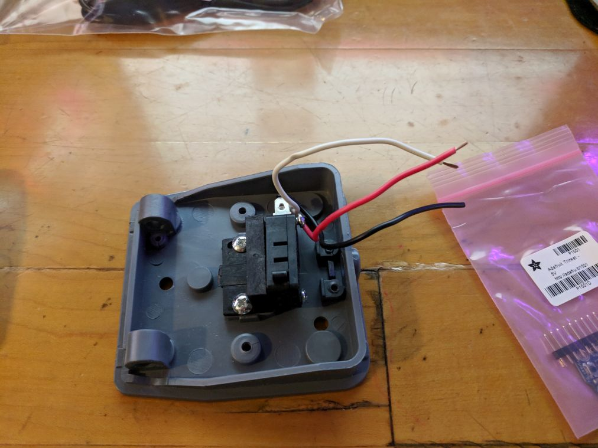

Original hole and usb cable connector size. Used dremmel with router head to carve the hole big enough to fit the cable in
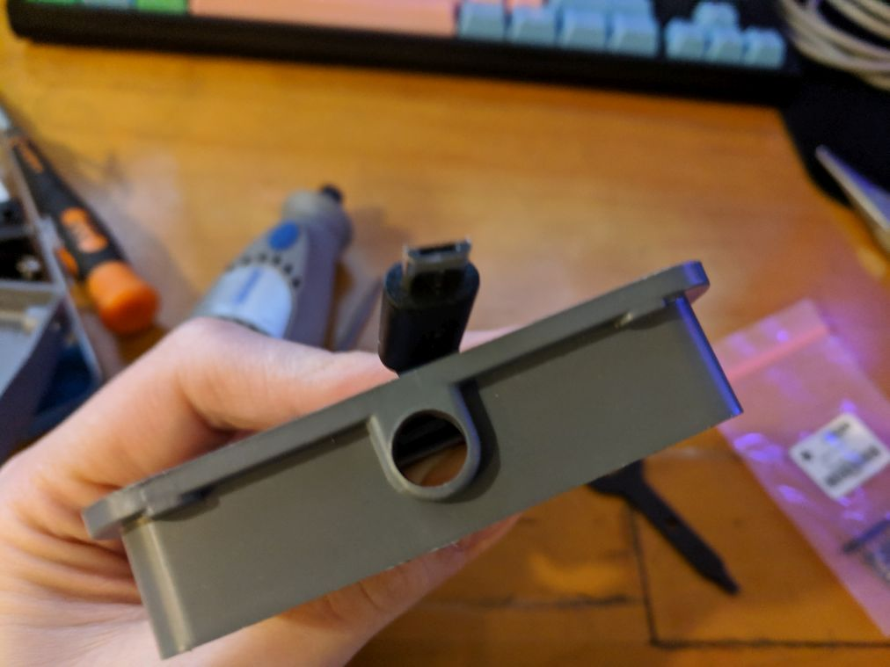

Soldering the cables using a cheap amazon soldering kit (following instructions in the Adafruit tutorial)
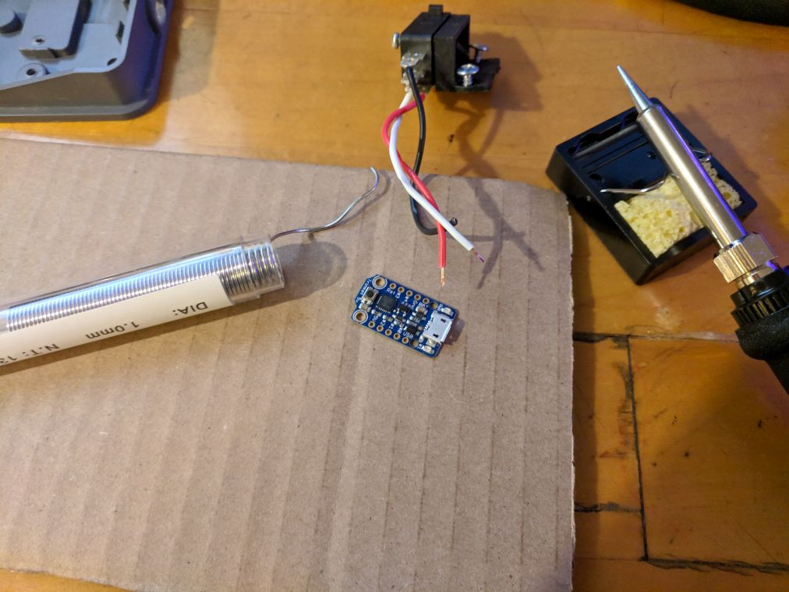

Excuse the terrible soldering job; but it works!
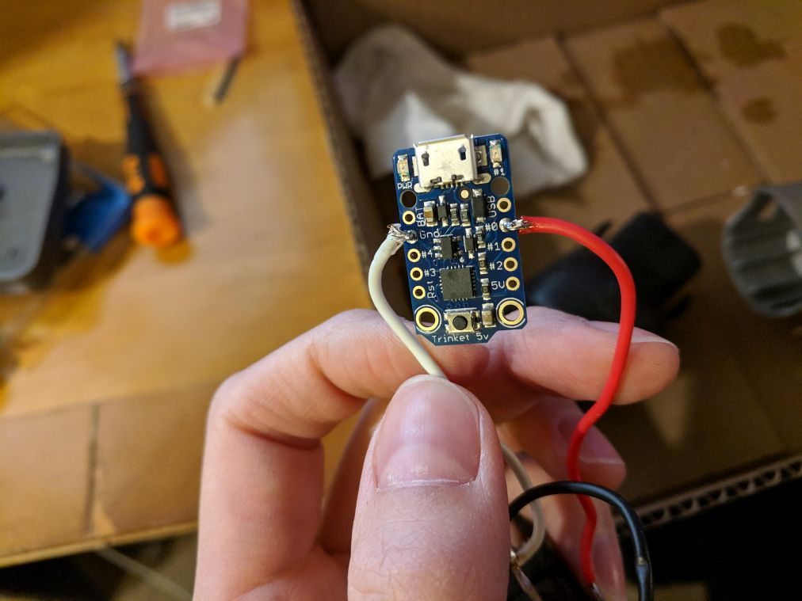

Cable snaked in and screwed into place, and connected
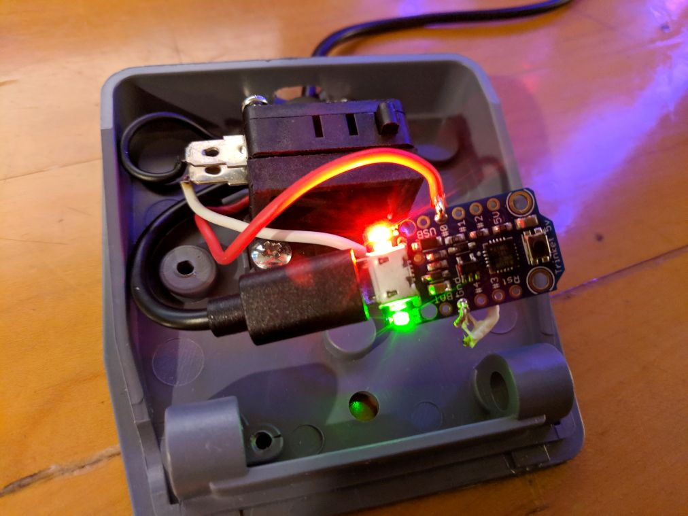

Programming the trinket based on some example code from the tutorial, with minor modifications to prevent button spam. I chose `n` as the key for "next". Also note board and programmer settings per the tutorial.
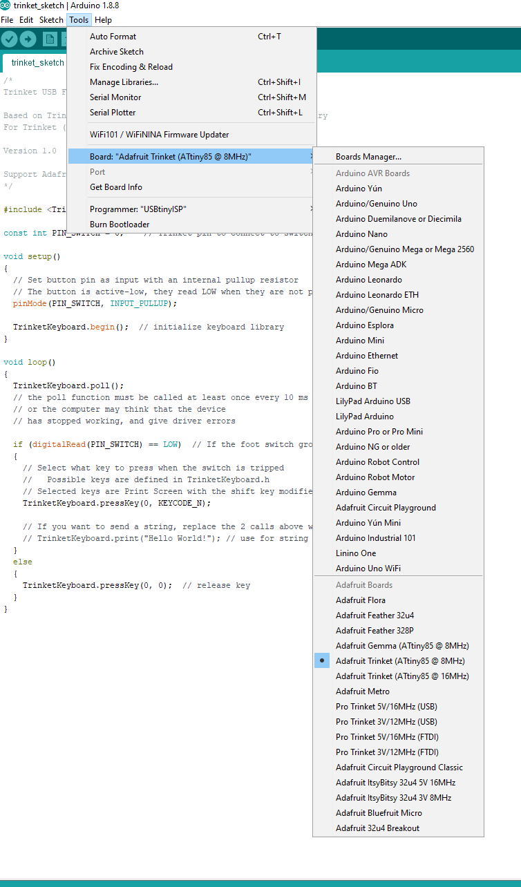

Sloppily hot glueing everything into place

Completed Switch
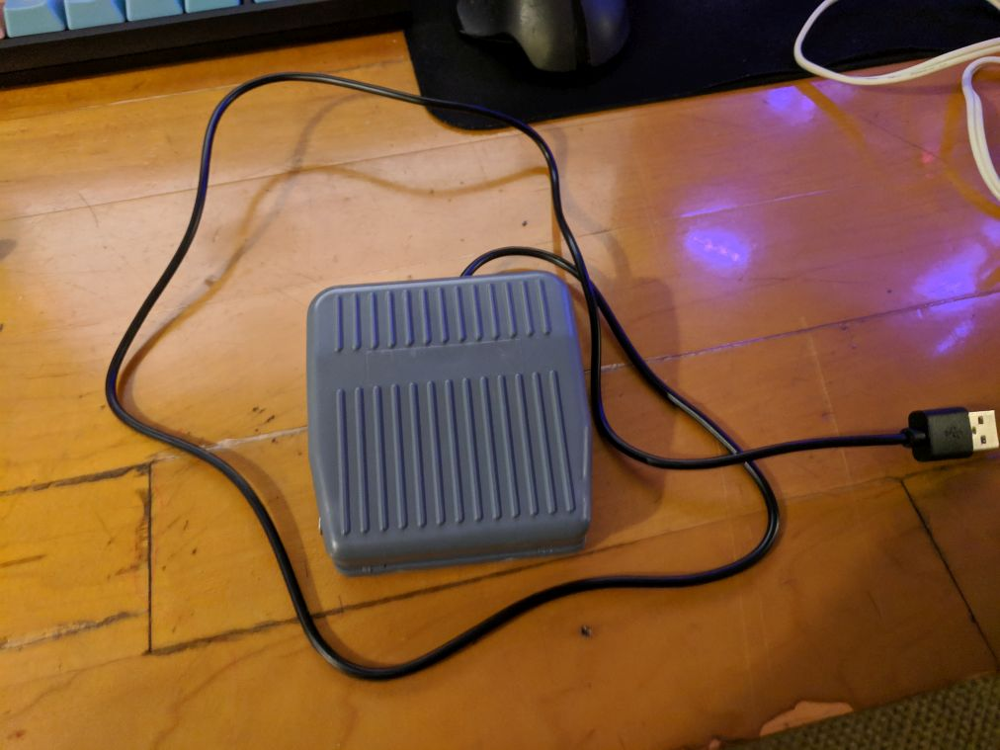

Piano setup with monitor and macbook driving it; any cheap comp could work, but I had this macbook available which is honestly way overkill

Sheet music pedal, and sustain pedal. Also shows macbook with usb-c/hdmi adapter driving the monitor, which also connects to a usb hub for mouse/keyboard/pedal
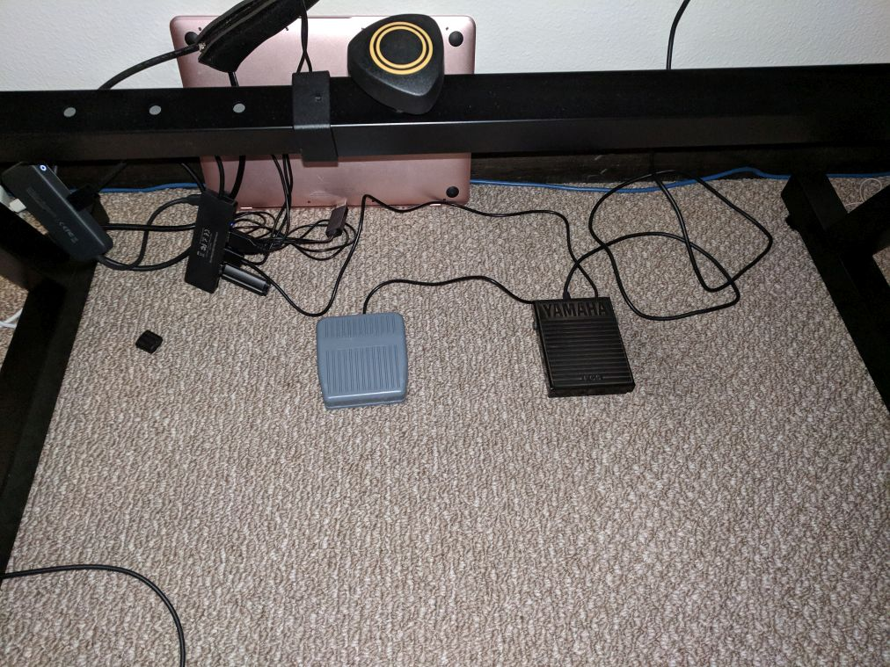